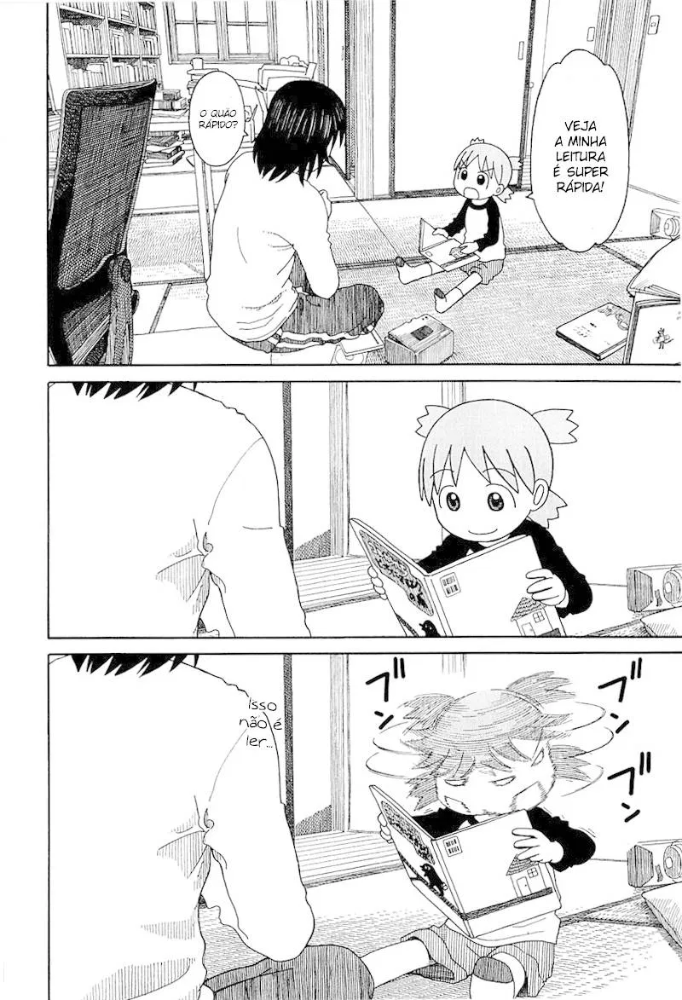

## MangoK

  
   

Projeto simples apenas para brincar um pouco com o **Kotlin Multiplatform**. O projeto base foi criado no [Compose Multiplatform Wizard](https://terrakok.github.io/Compose-Multiplatform-Wizard).

Ele gera um capítulo aleatório do mangá [Yotsuba to!](https://pt.wikipedia.org/wiki/Yotsuba%26!), sendo uma espécie de leitor simplificado. Utiliza o site [BR Mangás](https://www.brmangas.net) para extrair os capítulos. O objetivo não era ser um leitor de mangá nem nada do tipo, mas apenas um ponto de entrada para ver um pouco na prática o KMP. Apesar de conter a opção de web, esse projeto só funciona no Android e desktop. Devido a limitações, não posso testar no iOS.

- O projeto não segue bons padrões nem uma arquitetura específica, foi feito apenas para funcionar. :)

  
Eu lendo sobre KMP pra fazer esse projeto:

  

    
  

## Executar

- Android: `./gradlew :composeApp:assembleDebug`
- Desktop: `./gradlew :composeApp:run`
- Browser/Web: `./gradlew :composeApp:jsBrowserDevelopmentRun`

## Download APK

Se estiver interessado em testar o app, você pode baixar o APK nas [releases](https://github.com/jsericksk/MangoK/releases). Devido ao web scraping "manual" sem bibliotecas, pode parar de funcionar a qualquer momento, então se você baixar e não funcionar de forma alguma, provavelmente a extração dos dados não está mais funcionando.

## Bibliotecas utilizadas

- [Kamel](https://github.com/Kamel-Media/Kamel): Carregamento de imagens.
- [Ktor](https://github.com/ktorio/ktor): Obter código fonte das páginas.